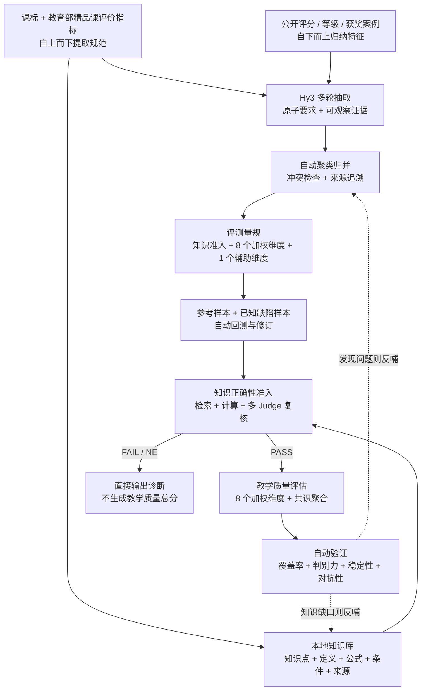
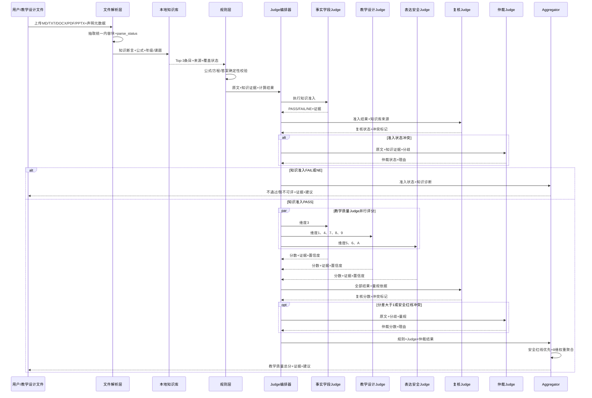

# 知教鉴（EduEval）：基于混元多智能体与本地知识库的初中数学教学设计质量评测系统

## 1. 场景与选题边界

**1.1 项目背景**

1. **AI 让教学设计生产变得很容易。** 大模型显著降低了教育内容的生成门槛，教师、学生和教育类产品可以快速产出教案、教学设计、讲解稿等材料。
2. **能产出、能考高分，却未必教得好。** 模型能够回答学科题目，并不等于能够设计一节好课。教学设计除知识正确外，还要处理课标对齐、学情分析、认知支架、学习活动和评价任务等问题。错误或不适切的内容一旦进入课堂，会放大对学生学习的影响，因此需要面向教学设计的专门质量评估。
3. **通用内容检查不能替代教学专业判断。** 常见的通顺度、格式或关键词检查难以判断教学目标是否可测、内容是否超纲、学习活动是否服务于目标，以及评价任务能否反映学习结果。本项目因此聚焦一套有权威依据、可解释、可复核的教学设计评测方法。

**1.2 选题边界**

**方案范围**

- 评估"生成物"本身的内容与教学逻辑质量（知识准确性、学段适配、环节设计、学情、表述、安全、启发引导等）
- 基于 Hy3 的自动化评估，输出可解释报告
- **学科与形态**：聚焦**初中数学单课时教学设计**
- **格式**：支持 **Markdown / TXT / DOCX / PDF / PPTX**；PDF 支持正文抽取与扫描页 OCR 兜底，PPTX 支持标题、正文、备注、页面顺序与基本版式信息抽取
- **中文场景**；用户声明目标年级 / 教材版本 / 课题 / 课时，系统识别实际难度并比对错配
- 自建初中数学本地知识库，存储可追溯的知识点、定义、公式、适用条件和常见错误，用于知识正确性准入校验
- 开发集由 Hy3 生成；公开评价标准和已有优质案例用于维度构建、量规回测与正向参照

**范围外事项**

- 不覆盖其他学科、其他学段、真实课堂实施效果、学生作业批改或一对一辅导
- 不替代教师的专业判断，也不自动生成最终教案或课件
- 不深度评价 PPTX 动画、音视频、复杂交互或视觉美学，仅评价教学内容、页面结构与基本可读性
- 不收录或重新发布无明确授权的教材全文；知识库仅保存开放授权内容、结构化知识条目和必要的来源索引
- 不训练 / 微调模型，仅调用 Hy3

## 2. 问题定义和设计思路

**2.1 问题定义与现有问题**

AI 让初中数学教学设计的生成变得容易，但生成物仍可能出现以下五类质量问题：

**一、知识错误（内容正确性层面）**
> 数理内容本身"对不对"，是质量底线；错则误人子弟。
- **① 知识性错误**：生成内容可能出现概念、公式、计算或例题解答错误，且常以语言流畅的形式呈现，不易被快速发现。

**二、知识能力越界（适切性层面）**
> 内容"对"但"放错了地方 / 用了错的方式"，超出学生该阶段应有的知识边界与认知水平。
- **② 超纲或认知错配**：内容与用户声明的目标年级、教材版本或课题范围不一致，可能超出学生已有知识与认知水平。
- **③ 学情分析空泛**：只写通用描述，未识别前置知识、常见误区、学习困难与学生差异，导致教学策略缺乏针对性。

**三、教学设计失配（目标、活动与评价层面）**
> 教学设计不仅要“环节齐全”，还要形成目标、学习活动与评价证据的一致关系。
- **④ 教学目标空泛或脱离课标**：目标不可观察、不可检测，或没有对应课程标准与本课学习内容。
- **⑤ 教学环节与策略失当**：教学流程残缺、衔接生硬，或以教师讲授为主，缺少与课型相适配的学生活动、问题支架和反馈。
- **⑥ 教—学—评脱节**：学习活动没有支撑目标，课堂评价、练习和作业也无法证明目标是否达成。

**四、表达规范与内容安全（可用性和育人导向层面）**
- **⑦ 表述歧义或不规范**：术语、符号、单位不统一，语言有歧义，易错点缺少提示，影响教师直接使用。
- **⑧ 价值导向偏差或内容不安全**：含不适龄、偏见、有害或违背育人目标的内容，或引用来源与版权信息不清。

**五、评测缺位与伪质量对抗（机制与对抗层面）**
- **⑨ 缺乏可解释的质量判断**：人工逐份审阅成本高且标准不易统一；通用内容检查又无法覆盖课标、学情与教学逻辑。
- **⑩ 表面包装可能骗过浅层检查**：堆砌教育术语、拉长篇幅或声称“符合课标”，可能让低质量内容看起来专业。

**研究问题**

本项目要回答的核心研究问题如下：

> **主研究问题**：如何定义"一份好的初中数学单课时教学设计"，并设计一套可操作、可复现、且能抵御表面包装的自动化评估方法？

可拆解为三个子问题：
- **子问题 1（评什么 · 维度可操作）**：如何将五类质量问题映射为判定标准明确、可操作的评估维度？
- **子问题 2（怎么评 · 自动化方法）**：如何以"规则 + 多 Judge + 共识聚合"的自动方式，对教学产物给出可解释的多维评分？
- **子问题 3（评得准 · 方法可信）**：如何验证该评估方法具备判别力、评判稳定一致、且能识破表面包装伪质量？

**核心难点**

- **知识正确性准入**：系统不能用其他维度的高分抵消任何知识错误。必须先逐项核验概念、公式、适用条件、推导和答案；发现错误直接 `FAIL`，证据不足直接 `NE`，只有通过后才计算教学质量总分。
- **量规可执行性**：课标和精品课指标多为原则性要求，需要转化为可观察证据、完整的 1–5 分锚点、强制扣分条件和红线规则，避免同一维度被任意解释。
- **知识库准确性与覆盖率**：知识正确性门槛依赖本地知识库。系统必须处理来源许可、公式标准化、适用条件、多来源冲突和知识覆盖缺口；未覆盖或无法核验的核心断言只能返回 `NE`，不能默认正确。
- **多 Judge 分歧消解**：事实、学段、教学法、安全和格式需要不同评判视角；系统必须明确各 Judge 的职责、证据格式、复核逻辑和仲裁条件，避免简单平均掩盖关键错误。
- **多格式信息保真**：PDF 和 PPTX 的页序、标题层级、备注、公式及扫描内容可能在解析中丢失。解析失败必须与内容低质区分，不能把“未抽取到”直接判成“原文没有”。
- **无人工作标注条件下的可信验证**：以官方标准和公开评价结果提供参照，以程序化缺陷注入提供可核验真值，再通过测试—重测和对抗样本检验稳定性与抗投机能力。该方案能够证明可追溯性、判别力和稳定性，但不宣称已经等同于教师专家判断。

**2.2 目标用户与痛点**

| 用户 | 身份 | 痛点（对应本章五类问题） |
|---|---|---|
| 直接用户 | 初中数学教师、教研员（含用 AI 辅助备课者） | 难以高效识别知识错误、超纲、学情分析空泛、目标—活动—评价脱节及安全问题；逐份人工核查费时 |
| 学习用户 | 师范生 | 缺少可解释、可复核的教学设计质量参照，难以形成稳定的自评与互评口径 |
| 间接受益者 | 初中学生 | 可能接触由低质量 AI 教学设计衍生的讲义、活动与作业，难以自行判断内容是否可靠、适龄 |

**2.3 设计思路**

设计遵循两个核心原则：**知识正确性是进入教学质量评分的前提；其余维度必须建立在权威规范和已有评价案例之上**。据此，设计主线定为“**证据提取 → AI 自动归并 → 知识库构建 → 参考样本回测 → 量规定型 → 准入校验与多维评估 → 自动验证**”。

- **（1）证据驱动地搭建候选维度（先定义“评什么”）**：从课程标准和教育部精品课评价指标自上而下提取规范要求，同时从公开的部级精品课、优质教学设计及已有评分案例中自下而上归纳可观察特征。
- **（2）AI 自动抽取、归并并形成初版量规**：由 Hy3 分多轮独立抽取“原子要求—可观察证据—候选维度”，再自动完成同义项聚类、冲突检查和来源追溯。只有能够对应官方条目或在多个优质案例中重复出现的候选项才进入初版量规，并自动生成完整的 1–5 分锚点、红线和不适用条件。
- **（3）构建本地知识库与知识准入规则**：从课程标准、开放授权知识数据和开放教育资源中抽取知识点、别名、定义、公式、适用条件、典型错误及来源信息，经公式标准化、多来源交叉验证和冲突隔离后写入 JSONL 与 SQLite FTS5 索引。
- **（4）利用已有评价样本自动回测量规**：优先搜集带公开评分、等级或明确评选结果的教学设计。带公开分数或等级的样本作为弱监督标签；只有获奖、入选信息而无逐维评分的样本仅作为正向参照。将其与已知缺陷注入样本共同回测，自动发现区分度低、定义重叠或容易误判的维度并修订。
- **（5）量规回测后落地为评估器并闭环验证**：EduEval 先解析多格式文件并抽取知识断言，通过知识库检索、程序计算和多 Judge 复核输出 `PASS / FAIL / NE`；只有知识门槛通过后，才执行其余教学质量维度评分。系统再在参考样本和程序化缺陷样本上验证知识检索、判别力、稳定性和对抗性，发现问题后回到步骤（2）或（3）修订。

> 设计思路流程（权威依据与已有案例 → 知识库与量规 → 知识准入 → 教学质量评估 → 自动验证）：



## 3. 总体方案与系统架构

**3.1 应用形态**

以**轻量 Web 应用**为主交付与演示形态：前端上传教学设计及目标元数据，后端调用评估核心，返回结构化质量报告。
- **输入**：教学产物文件（Markdown / TXT / DOCX / PDF / PPTX）+ **用户声明元数据**（目标年级 / 教材版本 / 课题 / 课时）。系统自动识别实际难度与知识范围，与声明目标比对以发现超纲 / 错配
- **输出**：先返回知识准入状态（`PASS / FAIL / NE`）及证据；`PASS` 后继续输出各维度评分、改进建议和总评，`FAIL / NE` 只输出知识诊断和处理建议。报告同时提供可机读 JSON、可读文本和 Web 可视化。
- **全自动工作流**：教师上传即评，无需人工标注或逐份核对。公开资料解析、量规构建、样本生成、缺陷注入、批量评测和指标计算均通过脚本与 Hy3 自动完成；人工仅配置资料来源、启动流程和查看结果，不参与逐样本打分。
- **混合自动评测**：系统先通过本地知识库检索、程序计算和事实 Judge 完成知识准入；只有 `PASS` 才进入其他专业 Judge 评分，再经复核、条件仲裁和确定性聚合生成最终报告，不包含人工审核环节。

**3.2 评估对象**

**「初中数学单课时教学设计」** 指用于指导一次初中数学单课时教学活动的教学设计 / 教案，常见交付为 Markdown / TXT / DOCX / PDF / PPTX，通常包含：
- 教学目标（对应课标要求）
- 学情分析与重难点
- 教学环节（情境导入 → 新知讲授 → 例题精讲 → 巩固练习 → 小结与作业）
- 数学内容本体（概念、公式 / 定理、例题与解答、练习题）
- （可选）板书 / 媒体设计说明

**形式约定**：Markdown / TXT / DOCX 保留标题层级和内容块；PDF 使用 PyMuPDF 抽取正文、页序和基础版式，文本不足时对扫描页进行 OCR；PPTX 使用 python-pptx 抽取标题、正文、备注、页面顺序、文本密度和基本版式信号。不评价动画、音视频、复杂交互和视觉审美；解析失败时返回 `parse_status`，不得直接按内容缺失扣分。
**学段 / 目标处理（声明 vs 识别）**：用户**声明**目标年级 / 教材版本 / 课题 / 课时；评估器**自动识别**内容实际难度与知识范围，将"声明目标"与"识别结果"比对，差异即超纲 / 错配信号，纳入「学段适配」维度（维度 3）判定。

**3.3 系统架构**

```text
┌─────────────────────────────────────────────────────┐
│  Web 应用层：前端上传 + 声明元数据 + 结果可视化          │
├─────────────────────────────────────────────────────┤
│  API / 接口层 (src/api/)  接收文件 → 调用评估核心       │
├─────────────────────────────────────────────────────┤
│  文件解析层 (src/parse/)  MD/TXT/DOCX/PDF/PPTX → 统一内容块 │
├─────────────────────────────────────────────────────┤
│  知识库层 (src/kb/)                                   │
│   ├─ sources.yaml     来源、许可与版本清单                │
│   ├─ ingest.py        抽取/标准化/去重/冲突隔离             │
│   ├─ schema.py        知识点与公式数据结构                  │
│   ├─ retriever.py     别名/元数据/SQLite FTS5 检索          │
│   └─ checker.py       断言比对与可计算内容校验               │
├─────────────────────────────────────────────────────┤
│  评估核心 (src/eval/)                                 │
│   ├─ rubric.py       维度优先级/权重/评分锚点             │
│   ├─ rules.py        公式·结构·红线等确定性校验            │
│   ├─ judges/         事实学段/教学设计/表达安全/复核/仲裁    │
│   ├─ orchestrator.py 多 Judge 并行调度与冲突检测           │
│   ├─ aggregator.py   分数、证据、红线与优先级聚合           │
│   └─ run_eval.py     评测主流程                          │
├─────────────────────────────────────────────────────┤
│  接入层 (src/app.py)  Hy3 OpenAI 兼容封装               │
│   (HY3_BASE_URL / HY3_API_KEY / HY3_MODEL)             │
├─────────────────────────────────────────────────────┤
│  数据层 (data/)  kb/knowledge.jsonl + knowledge.db     │
│                  samples.jsonl + labels/               │
├─────────────────────────────────────────────────────┤
│  输出层 (results/ + docs/)  结果表/归因/报告            │
└─────────────────────────────────────────────────────┘
```

**3.4 数据流**

教学设计（Markdown / TXT / DOCX / PDF / PPTX）+ 用户声明元数据 → **文件解析层生成统一内容块与解析状态** → **抽取知识断言、公式、推导和答案** → **按年级、课题、别名和公式检索本地知识库，并执行程序计算** → **事实 Judge、复核 Judge 与必要的仲裁 Judge 生成知识准入状态** → `PASS` 时运行其余教学质量 Judge 并聚合总分；`FAIL / NE` 时直接输出知识诊断，不生成教学质量总分。

## 4. 重点技术和评测方法

**4.1 重点技术**

- **Hy3 接入**：OpenAI 兼容端点，环境变量注入，endpoint-agnostic（不硬编码 Key）
- **知识库数据结构**：每条知识记录包含年级、教材版本、知识点、别名、定义、LaTeX 公式、适用条件、典型例题、常见错误、课标依据、来源链接、开源许可、版本和校验状态。
- **知识库自动构建**：从课程标准、开放授权数据和开放教育资源中抽取条目，经公式标准化、同义项合并、多来源交叉验证和冲突隔离后，保存为可审计的 JSONL，并建立 SQLite FTS5 索引。来源或许可不清的内容不进入正式库。
- **混合检索**：先按年级、课题、知识点别名、公式及适用条件进行精确检索，再由 Hy3 进行查询改写和关键词补充召回；不依赖额外向量数据库，避免公式语义相似造成误召回。
- **知识正确性准入**：提取原文中的知识断言、公式、推导和答案，结合知识库证据与程序计算进行逐项核验。任何确认的知识错误输出 `FAIL`；核心断言未覆盖、来源冲突或解析不可靠输出 `NE`；仅在全部核心断言可核验且未发现错误时输出 `PASS`。
- **规则校验**：关键公式、方程、例题答案、符号和学段关键词优先由程序进行确定性检查，结果作为知识准入和维度 3 的硬证据。
- **多 Judge 编排**：所有 Judge 均基于 Hy3，通过不同角色提示实现专业分工；事实与学段 Judge 先负责知识准入和维度 3，教学设计 Judge 负责维度 1、4、7、8、9，表达与安全 Judge 负责维度 5、6、A。知识准入通过后，后两类 Judge 才启动。
- **复核与条件仲裁**：复核 Judge 检查每个分数是否有原文证据和量规依据；主 Judge 与复核结果分差超过 1 分、红线判断冲突或证据无效时，才触发仲裁 Judge，控制成本和时延。
- **确定性聚合**：知识准入优先于所有权重；无争议教学质量维度取主 Judge 与复核分的均值并保留 0.5 分粒度，争议维度采用仲裁结果。规则命中的可计算错误、解析状态和知识库证据优先于无证据的 Judge 结论。
- **结构化输出**：所有 Judge 返回统一 JSON（准入状态、维度、分数、证据片段、知识库条目、来源、置信度、建议与红线标记），Aggregator 输出分歧记录和最终结论。
- **学段 / 目标比对**：用户声明目标年级 / 版本 / 课题；Hy3 识别内容实际难度与知识范围，比对声明检测超纲 / 错配（维度 3）
- **多格式解析**：Markdown / TXT 使用文本解析，DOCX 使用 python-docx，PDF 使用 PyMuPDF 并以 OCR 兜底，PPTX 使用 python-pptx；统一输出页面 / 幻灯片编号、标题层级、正文、备注、公式标记与解析置信度。

**4.2 评估维度（1 个知识准入门槛＋8 个加权维度＋1 个辅助维度）**

维度按“先知识准入、再教学质量”的顺序执行。G0 是总评前提；P0 可触发安全红线；P1 决定教学设计是否成立；P2 区分教学质量高低；P3 反映直接使用体验；辅助维度 A 单列，不进入总分。

| 优先级 | # | 维度 | 权重 | 核心判定 |
|---|---:|---|---:|---|
| **G0 准入** | 2 | 知识绝对正确性 | 不计权重 | 任一确认的知识错误即 `FAIL`；无法核验即 `NE`；只有 `PASS` 才进入后续评分 |
| **P0 底线** | 6 | 安全合规与价值导向 | 5% | 无有害、歧视、违法或严重不适龄内容；严重问题触发红线 |
| **P1 核心** | 1 | 教学目标明确性与课标对齐 | 20% | 目标可观察、可评价，并与课标和本课内容一致 |
| **P1 核心** | 3 | 学段与认知层次适配 | 15% | 实际知识范围、难度和前置要求与声明目标匹配 |
| **P1 核心** | 8 | 教—学—评一致性 | 20% | 目标、学习活动与评价证据形成闭环 |
| **P2 教学质量** | 4 | 教学环节设计合理性 | 15% | 环节适合课型，学生任务、教师支持和反馈明确 |
| **P2 教学质量** | 7 | 学情分析 | 10% | 分析真实前置基础、难点和差异，并转化为策略 |
| **P2 教学质量** | 9 | 学习者中心与启发探究 | 10% | 为学生思考、表达、反馈和自主建构提供支架 |
| **P3 可用性** | 5 | 表述清晰度与易懂性 | 5% | 语言、术语、符号和单位清晰一致 |
| **辅助** | A | 格式与基本可读性 | 不计分 | 文档 / 页面 / 幻灯片层级清楚、可解析、可阅读 |

**总评规则**：首先执行知识正确性准入。`FAIL` 直接判“不通过”，`NE` 判“暂不可评”，两者均不生成教学质量总分；只有 `PASS` 才执行其余维度。通过知识准入后，如安全严重红线成立则总评仍为“不通过”；否则按 8 个加权维度计算 `Σ（维度得分 ÷ 5 × 权重）`：85–100 为优秀，70–84 为良好，60–69 为合格，低于 60 为待改进。辅助维度 A 不参与总分。

**问题 → 维度映射**（第 2 章五类问题 → 主维度）：
- 知识错误（①）→ 维度 2（任何确认错误均导致知识准入 `FAIL`）
- 超纲与学情失配（②③）→ 维度 3（学段适配）、维度 7（学情分析）
- 教学设计失配（④⑤⑥）→ 维度 1（教学目标）、维度 4（教学环节）、维度 8（教—学—评一致性）、维度 9（学习者中心与启发探究）
- 表达与安全问题（⑦⑧）→ 维度 5（表述）、维度 6（严重问题触发**红线**）；格式归辅助维度 A
- 评测机制与伪质量问题（⑨⑩）→ 由可解释证据输出和 §4.4 对抗性验证整体回应

**维度构建依据与方法：四层证据链**

维度并非凭空设定，而是通过“规范自上而下提取 + 已有案例自下而上归纳 + AI 自动归并与回测”收敛而来，确保“评什么”有据可依、可被复核：

1. **课程标准规范（顶层锚定）**：以《义务教育数学课程标准（2022 年版）》为权威基准，提取初中数学各学段「内容要求 / 学业要求 / 教学提示」，确定知识范围、认知层次与学段边界。
2. **教育部精品课评价指标（官方维度来源）**：参照教育部「基础教育精品课」评价指标（教学目标、教学内容、教学过程、教学方法、教学设计、作业练习与资源规范等），将其转化为可观测的候选指标。
3. **已有评价案例归纳（实证归纳）**：优先选取带公开评分、等级或明确评选结果的教学设计，归纳其在目标设定、环节设计、启发引导和学情处理上的共同特征。仅有获奖或入选信息的案例只提供正向参照，不据此生成虚构的逐维标签。
4. **AI 自动归并与回测**：Hy3 分多轮独立抽取候选项，自动进行同义聚类、冲突检查、来源追溯和评分锚点生成；随后使用未参与抽取的参考样本与程序化缺陷样本回测，根据区分度、稳定性和误判案例自动提出合并或调整建议。

**现行公开依据与样本入口（调研阶段）**：

- [教育部：《义务教育课程方案和课程标准（2022 年版）》通知](https://www.moe.gov.cn/srcsite/A26/s8001/202204/t20220420_619921.html)
- [教育部：《义务教育数学课程标准（2022 年版）》](https://www.moe.gov.cn/srcsite/A26/s8001/202204/W020220510531636118932.pdf)
- [教育部：2025 年“基础教育精品课”遴选通知](https://www.moe.gov.cn/srcsite/A06/s3321/202509/t20250909_1412554.html)
- [教育部：2025 年“基础教育精品课”评价指标](https://www.moe.gov.cn/srcsite/A06/s3321/202509/W020250909418349249399.docx)
- [教育部：2025 年“基础教育精品课”名单公告](https://www.moe.gov.cn/jyb_xxgk/s5743/s5744/202604/t20260414_1433557.html)

**维度评分锚点**

**通用判分规则**：1 分表示缺失或严重不满足，2 分表示存在明显缺陷，3 分表示达到基本可用，4 分表示较完整且只有轻微不足，5 分表示证据充分、前后一致并可直接使用。Judge 必须引用页码、幻灯片编号或原文片段；没有证据的结论不得进入聚合。原文确实缺少内容时按锚点扣分；解析器无法可靠提取时标记 `NE（不可评）`，不得当作原文缺失。知识准入为 `NE` 或任一加权维度为 `NE` 时只输出已完成诊断，不生成最终总分；辅助维度 A 为 `NE` 不阻断内容评分。

**维度 1 教学目标明确性与课标对齐（P1，20%）**

- **证据**：教学目标、课标条目、本课内容、活动和评价任务之间的对应关系。
- **1 分**：没有教学目标，或目标与课题明显无关。
- **2 分**：有目标但以“培养能力、提升素养”等空泛表述为主，多数目标不可观察、不可评价，且无法对应课标。
- **3 分**：核心目标基本可观察并大体符合课标，但行为条件、达成标准或目标之间的层次不完整。
- **4 分**：主要目标具体可评，与课标、本课内容和主要活动基本对应，仅有少量覆盖或措辞缺口。
- **5 分**：目标具体、分层且可测，能够逐项追溯至课标要求，并与活动、练习和评价证据完整对应。
- **强制规则**：仅声称“符合课标”但不给出可核验内容不加分；完全没有可评价目标时最高 1 分。

**维度 2 知识绝对正确性（G0 准入，不计权重）**

- **核验对象**：概念、定义、公式、定理、适用条件、推导、计算过程、例题与练习答案。
- **证据链**：原文断言 → 本地知识库条目及来源 → 程序计算结果 → 事实 Judge 结论 → 复核 / 仲裁记录。
- **1 分**：核心概念、公式、定理、适用条件、推导或最终答案存在错误。
- **2 分**：存在多个一般性知识错误，或一个重要局部错误，需要明显修改才能使用。
- **3 分**：存在一处孤立的知识、推导或计算错误，即使不影响本课核心结论。
- **4 分**：未发现知识错误，全部核心断言可核验，但存在不影响正确性的非必要说明或推导省略。
- **5 分**：全部核心断言、公式、适用条件、关键推导和答案均有充分证据支持且可复核。
- **准入规则**：1–3 分均为 `FAIL`，直接判“不通过”；4–5 分为 `PASS`，进入后续教学质量评分。任一核心断言未被知识库或计算规则覆盖、来源相互冲突、公式 / OCR 解析不可靠时标记 `NE`，不生成总分。
- **误判保护**：纯排版问题、明确的 OCR 误识别或不改变数学含义的笔误不视为原文知识错误；无法确认是原文错误还是解析错误时必须返回 `NE`。知识错误只在本门槛记录，表述维度不重复扣分。

**维度 3 学段与认知层次适配（P1，15%）**

- **证据**：用户声明的年级、教材版本、课题和课时，与识别出的知识点、前置知识、任务难度和认知要求之间的差异。
- **1 分**：核心内容明显超出声明学段或依赖学生尚未学习的关键前置知识，整体不适用。
- **2 分**：多处内容、术语或任务难度超出目标范围，需要大幅删改或补充支架。
- **3 分**：主体符合目标学段，但存在少量顺序、前置知识或难度偏差。
- **4 分**：知识范围和认知要求匹配，前置知识说明基本充分，只有轻微版本或进度差异。
- **5 分**：与声明目标高度匹配，并根据学生前置基础安排认知阶梯、支架和适度拓展。
- **强制规则**：缺少年级、版本或课题等必要元数据时标记 `NE` 并要求补充，不由 Judge 猜测目标学段。

**维度 4 教学环节设计合理性（P2，15%）**

- **证据**：教学环节、时间或顺序、学生任务、教师支持、反馈方式以及环节间的逻辑关系。
- **1 分**：关键环节严重残缺或逻辑断裂，无法据此实施一节课。
- **2 分**：能够看出基本流程，但多个环节目的不明、任务缺失或衔接矛盾，需要大幅重构。
- **3 分**：主要环节可执行，基本服务教学目标，但学生任务、时间安排或反馈方式不够清楚。
- **4 分**：结构适合课型，环节衔接自然，学生任务与教师支持明确，只有局部细节需要补充。
- **5 分**：各环节围绕目标递进，任务、支架、反馈和调整路径完整，能够根据学生表现推进教学。
- **强制规则**：不要求机械套用“导入—新授—练习—小结”模板；若只列环节名称而没有实际任务与反馈，最高 2 分。

**维度 5 表述清晰度与易懂性（P3，5%）**

- **证据**：语言、术语、符号、单位、指代、例题说明和易错点提示。
- **1 分**：大量歧义、符号混乱或语句不通，已经妨碍理解和使用。
- **2 分**：多处术语、符号或指代不一致，需要集中修改才能使用。
- **3 分**：整体可读，存在少量歧义、冗余或提示不足，但不影响主要内容理解。
- **4 分**：语言简洁清楚，术语和符号基本一致，重点与易错点表达明确。
- **5 分**：表达准确、简洁且符合学生认知，符号单位全程一致，关键转折和易错点均有恰当提示。
- **强制规则**：知识事实错误归维度 2；本维度只评价表达造成的理解成本，避免同一问题重复扣分。

**维度 6 安全合规与价值导向（P0，5%，含红线）**

- **证据**：涉及年龄适宜性、歧视与标签化、隐私、违法违规、有害行为、绝对化承诺和育人导向的原文片段。
- **1 分**：出现明显有害、违法违规、歧视、严重不适龄或严重违背育人目标的内容。
- **2 分**：存在明确不当、标签化、隐私风险或误导性表达，虽范围有限但必须修改。
- **3 分**：整体安全合规，仅有个别措辞不严谨、刻板暗示或边界说明不足。
- **4 分**：无明显风险，语言尊重差异、符合年龄特点和教育场景规范。
- **5 分**：安全与育人要求自然融入教学设计，兼顾包容性、隐私和负责任的技术使用，无口号式堆砌。
- **红线规则**：1 分直接触发“不通过”；2–3 分按锚点扣分，不因轻微措辞直接否决。红线必须同时返回原文证据和风险类别。

**维度 7 学情分析（P2，10%）**

- **证据**：学生前置知识、已有经验、常见误区、学习困难、差异假设及其对应策略。
- **1 分**：完全没有学情分析，或分析对象、年级与实际课题明显错误。
- **2 分**：只有“学生基础较好、积极性较高”等通用套话，未形成任何教学决策。
- **3 分**：识别了主要前置知识或常见困难，但与教学活动、分层支持的联系较弱。
- **4 分**：学情与课题具体相关，能够据此安排支架、易错点处理或差异化任务。
- **5 分**：明确区分已知、未知和待诊断信息，设计诊断方式，并为不同学生反应准备分层任务与调整策略。
- **强制规则**：纯通用套话最高 2 分；不要求编造真实班级数据，合理陈述假设和诊断方式即可得高分。

**维度 8 教—学—评一致性（P1，20%）**

- **证据**：每项目标对应的学习活动、课堂检查、练习、作业或其他达成证据。
- **1 分**：目标、活动和评价彼此无关，无法判断目标是否达成。
- **2 分**：只有少数目标得到活动或评价支持，多数目标停留在表述层面。
- **3 分**：核心目标基本有相应活动和评价，但覆盖不完整或评价证据过于单一。
- **4 分**：大多数目标、活动和评价能够清晰对应，反馈可用于判断学习进展，仅有局部缺口。
- **5 分**：所有核心目标均有匹配的学习活动与可观察评价证据，评价结果还能反向触发反馈、补救或拓展。
- **强制规则**：没有任何评价任务时最高 2 分；只写“提问学生是否听懂”不能视为充分评价证据。

**维度 9 学习者中心与启发探究（P2，10%）**

- **证据**：学生思考任务、问题或示例链、表达与讨论机会、认知支架、理解检查和反馈调整。
- **1 分**：只呈现教师讲解或最终结论，没有学生思考任务和反馈机会。
- **2 分**：有形式化提问或活动，但答案已被直接给出，学生只需机械跟随。
- **3 分**：存在有意义的问题或任务，学生需要参与思考，但认知层次、支架或反馈较浅。
- **4 分**：问题或任务围绕核心难点递进，支持学生解释、比较、尝试和修正，并提供恰当支架。
- **5 分**：教学策略与内容和学情高度匹配，学生能够提出理由、形成或检验结论，教师可依据学生反应动态调整支架与任务。
- **强制规则**：不按提问数量评分，也不强制所有课型采用开放探究；讲授型课只要包含有效理解检查、学生加工和反馈，也可获得高分。

**辅助维度 A 格式与基本可读性（不计入主总分）**

- **证据**：标题层级、编号、页序 / 幻灯片顺序、文本密度、遮挡与截断、备注可用性及解析置信度。
- **1 分**：文件可打开和解析，但结构严重混乱、关键内容被截断或页面 / 幻灯片难以阅读。
- **2 分**：多处层级、编号或版式问题影响查找和连续阅读。
- **3 分**：基本可读，存在局部层级不一致、页面过密或版式瑕疵。
- **4 分**：结构清楚、顺序合理、版式一致，PDF / PPTX 的主要内容均可定位。
- **5 分**：层级、页序、版式和信息密度协调，能够支持教师快速定位目标、环节、例题和评价任务。
- **强制规则**：文件损坏、加密无法读取或 OCR / 公式抽取置信度过低时标记 `NE`，先提示解析问题，不把技术失败计为内容低质。

**4.3 评测语料与样本集**

- **知识库构建语料**：课程标准、明确开放授权的知识点 / 公式数据和开放教育资源。正式条目必须保留来源、许可、版本和适用条件；来源冲突的条目进入隔离区，不参与在线核验。
- **知识库检索测试集**：从未参与索引调优的知识条目生成不少于 100 条查询，覆盖标准名称、别名、公式、适用条件和常见错误，并保存期望命中的知识条目 ID，用于测量覆盖率与 Top-3 命中率。
- **维度构建语料**：课程标准、教育部精品课评价指标，以及约 10–15 份公开优质教学设计案例，只用于提取候选维度和评分证据。
- **公开参考样本集**：另选 10–15 份未参与维度构建的案例。优先采用带公开分数或等级的样本作为弱监督标签；仅有获奖、入选或官方推荐信息的案例，只记录“正向参照”标签，不补造具体分数。
- **自动构造开发集**：由 Hy3 生成 40 份初中数学单课时教学设计，并按自然生成、已知缺陷和对抗样本分层。已知缺陷通过程序自动注入，包括改错公式、篡改适用条件、加入错误推导或答案、混入超纲知识、删除关键环节和用“伪启发”话术包装灌输；注入位置、类型和严重程度作为可核验真值。任何已知知识错误样本的期望准入状态均为 `FAIL`。
- **多格式等价集**：选取同一教学设计转换为 DOCX、PDF 和 PPTX，并保留一份 Markdown 基准，用于检查不同文件格式下的内容维度评分是否基本一致；格式差异只允许影响解析状态和辅助维度 A。
- **自动评测重复集**：对同一批样本使用冻结参数重复运行，并以不同提示配置复评，只用于检查评分稳定性和提示敏感性，不承担外部真值角色。
- **数据独立性与版权**：知识库构建语料、检索测试集、维度构建语料、公开参考样本集和自动构造开发集用途分离；对外开源仅发布许可允许再分发的知识条目，其他内容只保存元数据、来源链接和必要摘要，未经授权不重新发布完整文件。
- **覆盖 / 分层**：覆盖七、八、九年级，覆盖 Markdown、TXT、DOCX、PDF、PPTX 五种格式，以及自然优质、一般、已知缺陷和对抗四类质量样本；自动构造开发集中对抗样本占比不低于 15%。

**4.4 有效性验证**

- **知识库可追溯性**：检查每个正式知识条目是否包含来源链接、许可、版本和适用条件；无来源或来源冲突条目不得参与准入判定。
- **知识覆盖与检索**：在知识库检索测试集上报告核心知识覆盖率和 Top-3 命中率，并按标准名称、别名、公式和条件查询分别统计失败案例。
- **知识准入判别力**：所有程序化注入的已知知识错误都应输出 `FAIL`，知识库未覆盖或证据冲突的核心断言应输出 `NE`，重点统计错误样本误通过率和正确样本误拒绝率。
- **量规可追溯性**：自动检查每个加权维度、锚点和判定理由是否能够回指课程标准、官方评价指标或公开案例证据，避免出现无来源的评价项。
- **解析有效性验证**：统计五种格式的解析成功率、OCR / 公式抽取置信度和关键内容块召回情况；解析失败样本必须返回 `NE`，不得生成看似正常的内容分数。
- **正向参照兼容性**：检查公开优质案例是否被误触发知识或安全红线，并分析低分维度。若样本带公开分数或等级，再计算自动评分与公开结果的 Spearman 排序相关；若只有获奖信息，则只报告通过率和案例分析。
- **教学缺陷判别力**：对已通过知识准入的样本注入非知识类教学缺陷；缺陷越多或越严重，目标维度与教学质量总分应单调下降，且错误证据应定位到注入位置。
- **多 Judge 一致性**：报告专业 Judge 与复核 Judge 的平均分差、准入状态冲突、安全红线冲突和仲裁触发率；所有准入冲突、分差超过 1 分或红线冲突的样本必须进入仲裁并保留记录。
- **稳定性与跨格式一致性**：同一样本在冻结配置下重复评测，并比较等价内容的不同文件格式；报告平均绝对分差、各维度波动和排序相关性。
- **对抗性验证**：自动构造术语堆砌、伪造“符合课标”声明、用篇幅掩盖错误和“伪启发”等样本，检查评估器是否被骗高分。

本项目不新增教师人工标注，因此不计算教师 ICC 或人机 Kappa，也不宣称完成了专家级外部有效性验证。结论限定为：知识条目和量规可追溯，知识库覆盖范围内的已知错误不会被其他维度高分抵消，教学缺陷具备可测判别力，并在重复运行中保持基本稳定。

**4.5 评测执行流程**

下图给出单次评测的端到端执行时序，对应 §4.1 重点技术与 §3.4 数据流：



## 5. 预期效果与验收指标

**5.1 任务要求对照**

| PDF 要求 | 本方案满足方式 |
|---|---|
| 基于 Hy3 的可运行 AI 应用 | EduEval 评估器（Web 应用） |
| 真实用户场景 + 说明必要性 | 教师直接质检痛点与学生间接受益，§2.2 目标用户与痛点 |
| 建议覆盖 5 个以上可操作评估维度 | 1 个知识准入门槛 + 8 个加权维度 + 1 个辅助维度，§4.2 |
| 避免模糊判定 | 每维度给可操作标准 |
| 自动 / 半自动评测 | 规则 + Hy3 多 Judge + 条件仲裁的全自动评测 |
| 说明选型设计依据 | §4.1 选型依据 |
| 样本含难例与反例 | §4.3 分层 |
| 判别力 + 一致性验证（≥2） | §4.4 |
| 完整评测 + 结果表 + case 归因 | results/ |
| README + 分析报告 + demo | §5.3 交付物清单 |

**5.2 量化验收指标**

以下阈值以“知识来源可追溯、核心知识可覆盖、错误样本不误通过、教学缺陷可区分、重复运行较稳定”为目标，并以浅层基线（仅看篇幅、术语密度和课标关键词命中）为对照：

- 知识库可追溯性：正式知识条目的来源链接、许可、版本和适用条件完整率 100%，来源冲突条目不进入在线检索
- 知识覆盖与检索：在不少于 100 条独立查询上，评测集核心知识覆盖率 ≥ 90%，Top-3 检索命中率 ≥ 90%
- 知识准入：程序化注入的已知知识错误样本误通过率为 0%；知识库未覆盖或证据冲突的核心断言返回 `NE` 的比例为 100%
- 量规可追溯性：G0 准入规则和 8 个加权维度均能对应至少一项课程标准、官方评价指标或公开案例证据，来源覆盖率 100%
- 多格式解析：有效测试文件的解析成功率 ≥ 95%；无法可靠解析的文件必须返回 `NE`，不得生成虚假完整评分
- 教学缺陷判别力：在知识准入通过的同一基准样本上，按无缺陷、轻度缺陷、重度缺陷排序，目标维度与总分的顺序正确率 ≥ 90%
- 缺陷定位：已知注入缺陷的识别率 ≥ 80%，且报告证据能够定位到注入片段
- 公开结果兼容性：知识库覆盖范围内的正向参照样本，知识准入误判为 `FAIL` 的比例 ≤ 5%；若搜集到不少于 10 份带公开分数或等级的样本，再报告教学质量得分的 Spearman 相关，目标 ρ ≥ 0.6
- 多 Judge 冲突处理：准入状态冲突、分差超过 1 分、安全红线冲突或证据缺失的结果进入仲裁比例为 100%，最终报告保留完整分歧记录
- 稳定性与跨格式一致性：冻结配置下测试—重测平均绝对分差 ≤ 0.5 分；同内容不同格式的主维度平均绝对分差 ≤ 0.5 分，排序相关性 ≥ 0.8
- 对抗性：对抗样本被误判为高分（≥4 / 5）的比例 ≤ 20%
- 评测覆盖：初中三个年级和五种输入格式均有样本；知识检索测试查询不少于 100 条，自动构造开发集 40 份、独立公开参考样本 10–15 份；对抗样本占开发集比例 ≥ 15%

**5.3 交付物清单**

- [ ] 开源仓库：Web 应用源码（前端 + API 后端）+ README + 环境配置样例 + 运行说明
- [ ] 知识库材料：`sources.yaml` + 知识条目 schema + 可再分发的 `knowledge.jsonl` + SQLite 索引构建脚本 + 数据卡与许可说明
- [ ] 评测材料：样本集 + 评估方法说明文档 + 评测脚本 + 完整结果表格
- [ ] 有效性验证结果：实验过程与数据
- [ ] 分析报告：场景选择理由、解决方案、维度设计依据（含四层证据链、AI 自动归并与回测）、评测结论、失败模式归纳、能力边界、典型案例和自动验证结果
- [ ] ≤2 分钟 demo 视频或 GIF（上传 PDF / PPTX → 展示知识库证据与 `PASS / FAIL / NE` → 通过后展示多 Judge 教学质量评分）

**能力边界与已知局限**：① “知识绝对正确”在工程上定义为“可核验范围内未发现任何错误”；知识库未覆盖、来源冲突或解析不可靠时必须返回 `NE`，不能宣称已经证明原文绝对正确。② 自动验证不能替代专家评审或真实课堂效果验证；获奖、入选案例若没有公开逐维分数，只能作为正向参照。③ 本方案仅覆盖**初中数学单课时教学设计**，不评价 PDF / PPTX 中的动画、音视频、复杂交互或视觉美学。④ 不同教材版本的章节顺序可能不同，知识条目和超纲判断必须绑定版本、课题与适用条件。⑤ DOCX 复杂公式、扫描 PDF 和 PPTX 嵌入对象可能产生解析误差，报告必须区分“内容错误”“知识库未覆盖”和“解析失败”。

**5.4 红线与合规检查**

- [ ] 不硬编码 / 提交 API Key（走环境变量 / 配置文件）
- [ ] 命名与 README 标注为个人 / 活动作品（避免误认腾讯官方）
- [ ] 模型调用仅走 Hy3，不训练 / 微调
- [ ] 知识库条目保留来源、许可、版本和更新时间；不重新发布无明确授权的教材全文
- [ ] 自行建公开仓库交链接，**不向 Hy3 官方仓库提 PR**
- [ ] 参考链接：https://github.com/Tencent-Hunyuan/Hy3

## 6. 项目时间规划

| 周次 | 任务 | 预计时长 |
|---|---|---|
| 第 1 周 | D1 确定知识来源、许可、schema 和量规依据；D2 用 Hy3 自动抽取、标准化、去重并建立 JSONL / SQLite FTS5 知识库；D3 实现知识断言抽取、检索和程序计算，跑通知识准入；D4 完成五种文件格式解析；D5 实现事实、教学设计、表达安全、复核与仲裁 Judge；D6 完成 Aggregator 与 Web 展示；D7 构建开发集和参考样本 | 6–7 天 |
| 第 2 周 | D8 构建不少于 100 条知识检索查询、多格式等价集和知识错误注入样本；D9–D10 完成知识覆盖、Top-3 命中、准入误通过、解析有效性、Judge 分歧、教学缺陷判别力、跨格式一致性、稳定性和对抗性实验；D11 整理知识库数据卡、结果表、README、分析报告和 2 分钟 Demo；D12 完成开源仓库、自检并提交链接 | 5–6 天 |
